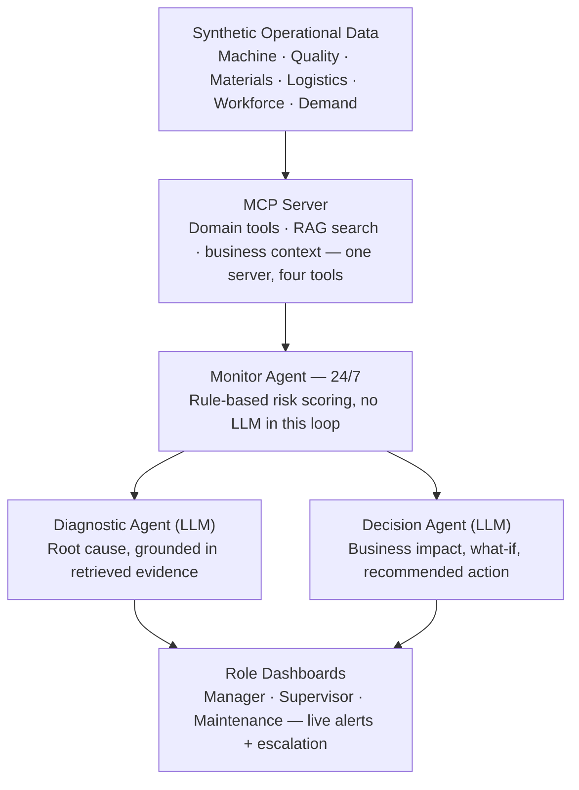

# Relix

**AI-Enabled Production Disruption Early Warning System**

Relix is a real-time monitoring and decision-support platform for manufacturing plants. It watches production, quality, materials, logistics, workforce, and demand signals continuously, catches disruption risk before it hits output or delivery, and explains *why* it's happening and *what to do about it* — grounded in real historical incidents, not guesses.

> Built for the **TCS TechDay AI Hackathon**.

---

## Table of Contents

- [The Problem](#the-problem)
- [Our Approach](#our-approach)
- [Key Features](#key-features)
- [System Architecture](#system-architecture)
- [How It Works — Step by Step](#how-it-works--step-by-step)
- [Tech Stack](#tech-stack)
- [Project Structure](#project-structure)
- [Getting Started](#getting-started)
- [API Reference](#api-reference)
- [Data Model](#data-model)
- [Team](#team)

---

## The Problem

Manufacturing plants face constant, unpredictable disruption — machine downtime, material delays, quality deviations, workforce constraints, and shifting demand priorities. These are usually detected only **after** they've already hit output, delivery commitments, or cost. Plant teams are left relying on fragmented reports, manual escalation, and gut-feel judgment. Existing dashboards show what already happened — not what's likely to happen next, or what the best response is.

## Our Approach

Relix treats disruption detection as **one unified problem across six operational domains**, not six disconnected tools:

- **Machine & Maintenance** — equipment health, downtime, service history
- **Quality** — inspection outcomes, defect trends
- **Materials / Procurement** — inbound stock and supplier delays
- **Logistics** — outbound dispatch, warehouse capacity, delivery slippage
- **Workforce** — staffing, skill gaps, absenteeism
- **Demand / Orders** — priority shifts, capacity pressure

A single generalized signal schema lets one detection pipeline serve all six domains, one 24/7 monitoring loop catch risk the moment it crosses a threshold, and one AI reasoning layer explain root cause and recommend a response — grounded in real precedent via retrieval-augmented generation (RAG), not hallucinated.

## Key Features

| # | Feature | What it does |
|---|---------|---------------|
| 1 | **24/7 Monitor Agent** | Continuously scans every domain and fires alerts the moment risk crosses threshold — detection isn't click-triggered |
| 2 | **RAG-Grounded Root Cause** | Retrieves matching past incidents and SOPs so explanations cite real precedent |
| 3 | **Parallel Diagnostic + Decision Agents** | Root cause and business impact are computed simultaneously, not sequentially |
| 4 | **Business Impact & What-If Comparison** | Every incident compares do-nothing vs. response options in cost, units, and delay |
| 5 | **Role-Based Dashboards** | Manager, Supervisor, and Maintenance views built from one shared incident feed |
| 6 | **Escalation Workflow** | Acknowledge → Escalate → Resolve, with a live, auditable status trail |

## System Architecture



**Design principles:**
- **One pipeline, six domains** — a single `Signal` schema covers every domain, so detection logic isn't duplicated six times.
- **Detection is deterministic, reasoning is generative** — the Monitor Agent is pure rules/thresholds (fast, explainable, no LLM latency); the Diagnostic and Decision agents are where the LLM adds value.
- **Parallel, not sequential** — Diagnostic and Decision agents run concurrently (`asyncio.gather`) off the same signals, so business impact isn't waiting on root-cause analysis to finish.
- **One MCP server** — a single Model Context Protocol server exposes domain status, signal history, knowledge-base search (RAG), and business context as four tools, shared by both agents.

## How It Works — Step by Step

1. **Signals come in.** Synthetic (or real) data across all six domains is normalized into a common `Signal` schema — entity, domain, metric, value, threshold, and an optional text note.
2. **The Monitor Agent watches continuously.** Running as a 24/7 background loop, it computes a weighted risk score per line/entity. No LLM call happens here — this stage has to be fast and deterministic.
3. **A threshold breach triggers an incident.** The moment risk crosses the line, the Monitor Agent hands the triggering signals off to the orchestrator and pushes a live alert to the frontend.
4. **Two agents reason in parallel.**
   - The **Diagnostic Agent** queries the MCP server for domain status, signal history, and relevant knowledge-base entries (past incident reports, root-cause analyses), then produces a plain-language root cause explanation with cited evidence.
   - The **Decision Agent** queries business context (targets, orders, cost-per-hour-downtime) and relevant SOPs/escalation policies, then produces a business-impact estimate, a what-if comparison across response options, and a recommended action.
5. **Results are merged.** Once both agents resolve, their output is merged into a single `DisruptionIncident` object, including role-specific one-line summaries for Plant Manager, Supervisor, and Maintenance.
6. **The incident reaches the right people.** Alerts are routed by severity and domain to the roles who need to see them, and pushed live over WebSocket (with a polling fallback).
7. **Teams act and track resolution.** From the dashboard, an incident can be Acknowledged, Escalated, or Resolved — every transition is logged for a full audit trail.

## Tech Stack

| Layer | Choice |
|---|---|
| Backend | FastAPI (single process), Python `asyncio` |
| Agent orchestration | `asyncio.gather()` for parallel Diagnostic + Decision agents |
| Tool layer | Model Context Protocol (MCP) — one server, four tools |
| Knowledge retrieval (RAG) | Chunked incident reports & SOPs → embeddings → Chroma vector store |
| Real-time alerts | FastAPI WebSocket, polling fallback |
| Frontend | React (Vite) |
| Data persistence | In-memory / JSON (hackathon scope) |

## Project Structure

```
/backend
  /data              # synthetic data generators for all six domains
  /mcp_server         # single MCP server: domain tools, RAG store, business context
  /monitor            # 24/7 monitor agent + risk scoring rules
  /agents             # diagnostic agent, decision agent, orchestrator
  main.py             # FastAPI app, REST routes, WebSocket
  models.py           # shared schemas (Signal, DisruptionIncident, Alert)
/frontend
  /manager            # Plant Manager dashboard
  /supervisor         # Supervisor dashboard
  /maintenance        # Maintenance dashboard
  /shared             # role switcher, alert toast, domain filter
```

## Getting Started

### Prerequisites
- Python 3.10+
- Node.js 18+
- An API key for your LLM provider (used by the Diagnostic and Decision agents)

### Backend

```bash
cd backend
python -m venv venv && source venv/bin/activate
pip install -r requirements.txt
uvicorn main:app --reload
```

### Frontend

```bash
cd frontend
npm install
npm run dev
```

The frontend expects the backend at `http://localhost:8000` by default — update the API base URL in your frontend config if this differs.

## API Reference

| Method | Route | Description |
|---|---|---|
| `GET` | `/api/incidents` | List all incidents, sorted by risk score |
| `GET` | `/api/incidents/{incident_id}` | Get a single incident's full detail |
| `PATCH` | `/api/incidents/{incident_id}/status` | Update status: `ACKNOWLEDGED` \| `ESCALATED` \| `RESOLVED` |
| `GET` | `/api/alerts?role={role}` | List alerts routed to a given role |
| `WS` | `/ws/alerts` | Live alert stream as the Monitor Agent fires new incidents |
| `GET` | `/api/domains/{domain}/signals?line_id={id}` | Raw signals for a domain/line, for drill-down |

## Data Model

The core object every screen renders from is `DisruptionIncident`:

```json
{
  "incident_id": "INC-204",
  "domain_mix": ["machine", "quality"],
  "line_id": "LINE-4",
  "risk_score": 0.78,
  "risk_level": "HIGH",
  "status": "OPEN",
  "signals": [ "..." ],
  "diagnostic": {
    "root_cause": "Machine M17 bearing wear",
    "evidence": [ "..." ],
    "explanation": "Vibration rose 31% over 3 days alongside a defect-rate increase; maintenance is overdue."
  },
  "decision": {
    "business_impact": { "units_at_risk": 8400, "estimated_cost_inr": 140000, "delivery_delay_hours": 11 },
    "what_if": [ "..." ],
    "recommended_action": { "action": "SHIFT_TO_LINE_3", "reason": "...", "escalation_required": true }
  },
  "role_summaries": {
    "plant_manager": "...",
    "supervisor": "...",
    "maintenance": "..."
  }
}
```

## Team

Built by a team of 5 — 3 backend engineers, 2 frontend engineers — at the TCS TechDay AI Hackathon.

---

*From reactive firefighting to proactive production continuity.*
